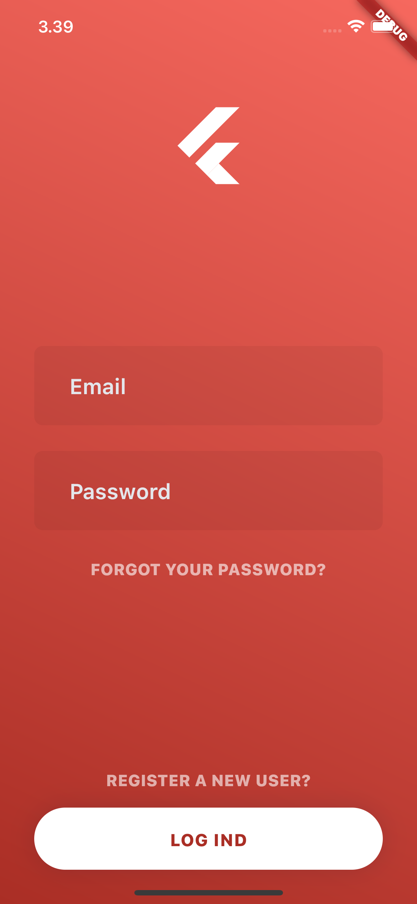
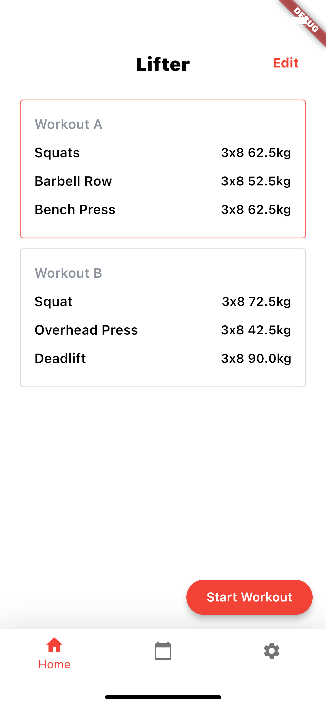
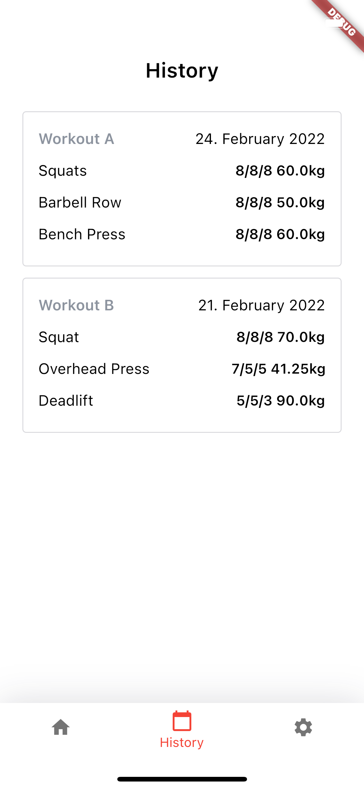

# Stronglift Clone

[](http://badges.mit-license.org)

> A clone project of the popular mobile workout app [Stronglifts](https://stronglifts.com) built with [Flutter](https://flutter.dev) and [Firebase](https://firebase.com).


*Michael Guldborg 2021*

<p align="center">
	<a href="https://stronglift.michaelguldborg.dk">
		https://stronglift.michaelguldborg.dk
	</a>
</p>

<p align="center">
	<a href="#Preview">Preview</a> •
	<a href="#Features">Features</a> •
	<a href="#Development">Development</a> •
	<a href="#References">References</a>
</p>

## Preview

<p align="center">
	
	
	
	
</p>


## Features

| Name                | Description |  Done   |
|---------------------|-------------|:-------:|
| Authentication      |             | &#9745; |
| Create workout plan |             | &#9745; |
| Start workout       |             | &#9745; |
| View statistics     |             | &#9745; |
| <b>Total</b>        |             |   4/4   |

## Development

```bash
# Install dependencies
$ flutter pub get

# Run on application
$ flutter run

# Deploy to production
$ git push origin master
```

## References
- [GitHub](https://github.com/)
- [Flutter](https://www.flutter.dev/)
- [Firebase Authentication](https://firebase.google.com/docs/auth/)
- [Firebase Firestore](https://firebase.google.com/docs/firestore)
- [Netlify](https://www.netlify.com/)

